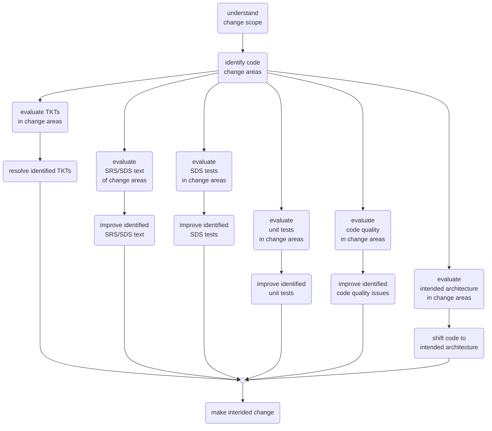

# Making a Change

## Approach

When we make a change to a given code area for adding a feature or resolving an issue, this is an opportunity to make other improvements without adding risk or substantially increasing testing effort. Ideally, we would work on cleaning activities ahead of making the intended change. We also need to think of the cleaning activities as part of the work. These improvements can include:

* Resolving outstanding TKTs
* Improving the SRS and SDS requirements
* Improving  and extending the associated SDS tests
  * I.E. the new behavior-test framework
* Improving and extending unit tests
* Improving code quality
* Shifting to the intended architecture.

The improvements are in a prioritized order, with the idea that TKTs make the basic functionality more correct. SRS/SDS requirements text improvements clarify the intended behavior. SDS testing and unit test improvements protect against unintended changed (introduced bugs). Code improvements create more easily and reliably changed code, thus enabling work on improving architecture.

## How much effort?

There is a balancing point about how much improvement to do before making the intended change. We will need to do some tuning to ensure the core delivery doesn't run late. Most efforts (feature addition, bug fix) should include some improvement efforts.  Hot-fixes, or tasks identified late in a release cycle, may choose to forgo any other improvements.

## end
